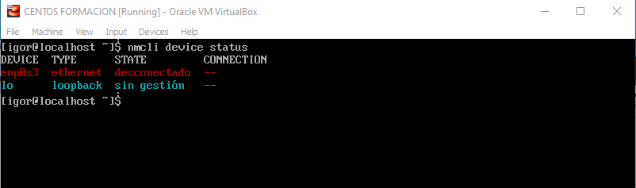

# Conectar CentOS a una red

En caso de que al usar el comando

    hostname -I

No obtengamos una IP, tendremos que conctar la red manualmente

Para ello usaremos el comando:
    nmcli device status

Este nos indicara todas las redes disponibles. Entre las cuales, estara disponible la red que creamos anteriormente en VirtualBox.

> En el ejemplo de la imagen seria la red "enp0s3"

Para conectar a dicha red usaremos el comando:

    nmcli device connect [DEVICE NAME]

Y posteriormente podemos comprobar la conexion usando el comando

    hostname -I

> Siguiendo el ejemplo, el comando seria nmcli device connect enp0s3