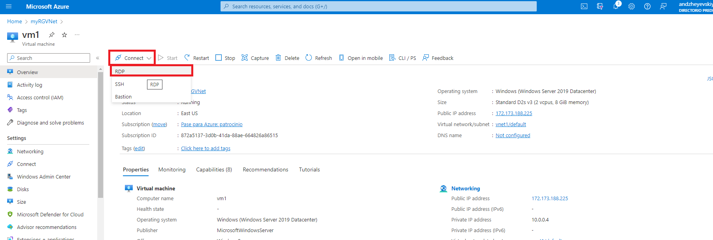

# Exercise 4: Create a Virtual Network

## Task 1: Create Virtual Network

Entramos en el portal de Azure y seleccionamos Redes Virtuales. Y le damos a crear.

## Task 2: Create two virtual machines.

Desde el servicio de maquinas virtuales creamos dos maquinas virtuales y las conectamos a la misma red.

Una vez creadas las dos maquinas, el esquema quedaria asi:

## Task 2: Test the connection.

Nos conectamos a las maquinas virtuales via RDP, usando el usuario y contraseña estableciados. Y desde Command prompt, corremos el comando:

"ping (vm1/vm2)" Dependiendo de la maquina virtual en la que nos encontremos, en caso de estar en vm1, haremos ping a la vm2, y viceversa.

Como verá, no existe conexion entre ambas maquinas, esto se dá dado que no existen reglas de entrada en la maquina destino. Para ello debemos habilitarlas con el comando: 

"New-NetFirewallRule –DisplayName “Allow ICMPv4-In” –Protocol ICMPv4"

Finalmente probamos nuevamente la conexion entre las maquinas.

