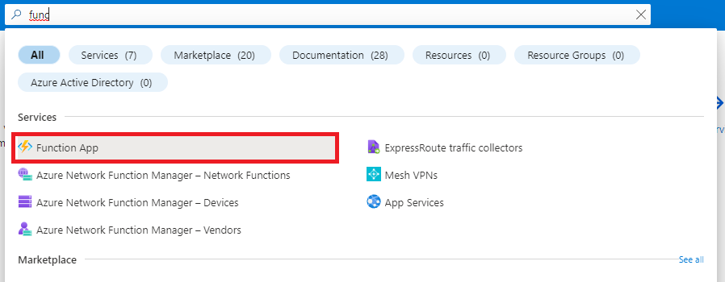
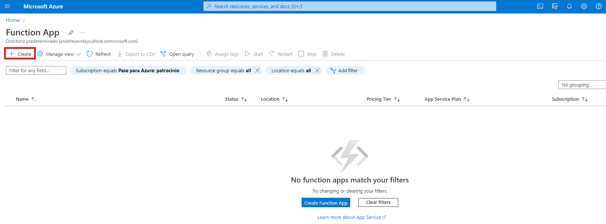
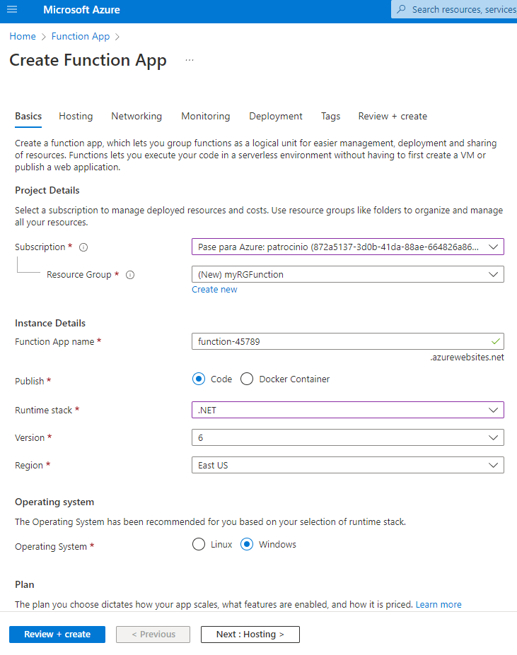
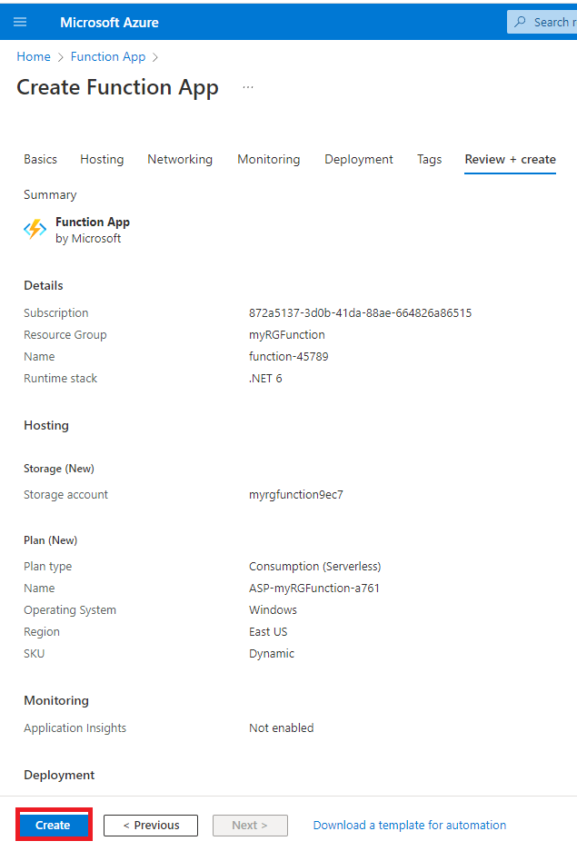
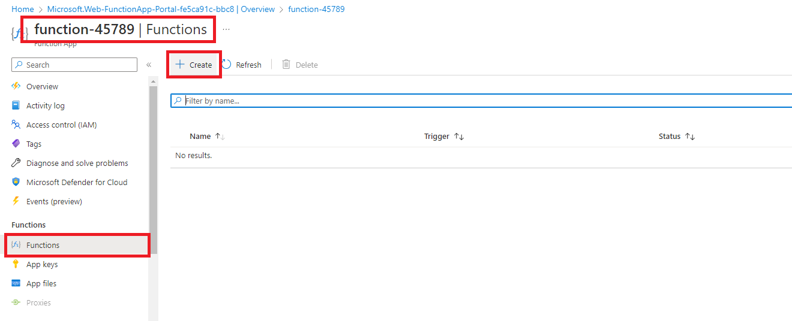
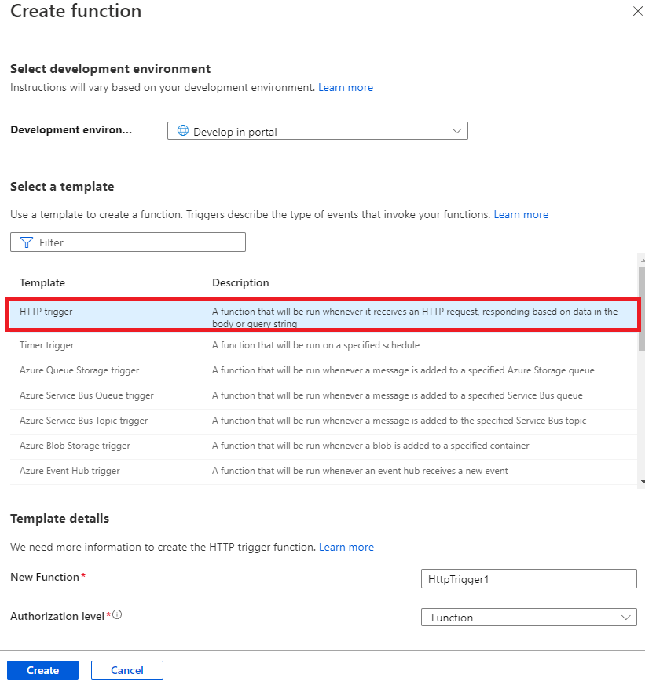
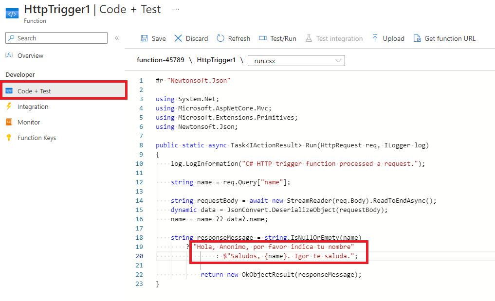
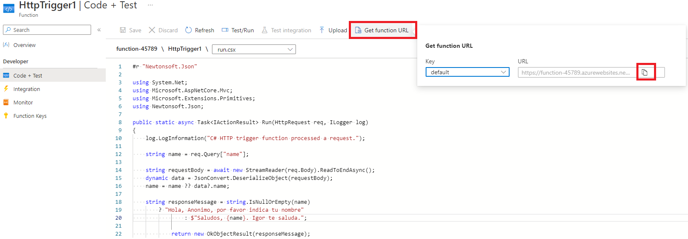
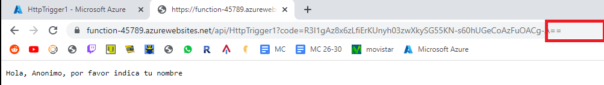
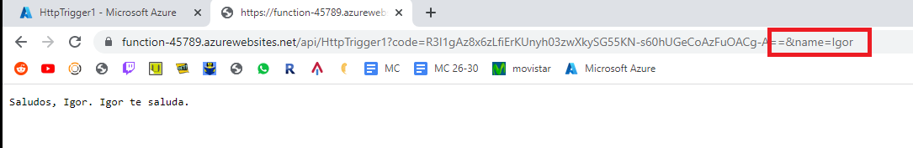

# Implement Azure Functions

## Task 1: Create a Function app.

Desde el portal de Azure Seleccionamos Function App, y le damos a Create.

## Task 2: Create a HTTP triggered function and test

Entramos en la funcion recien creada, en la pestaña de funciones, y añadimos una nueva.

Una vez creada entramos en Code + Test y modificamos el texto de prueba en funcion de la necesidad:

Guardamos y obtenemos el enlace de la funcion:

Y comprobamos su funcionalidad en funcion de si se indica el nombre o no:

