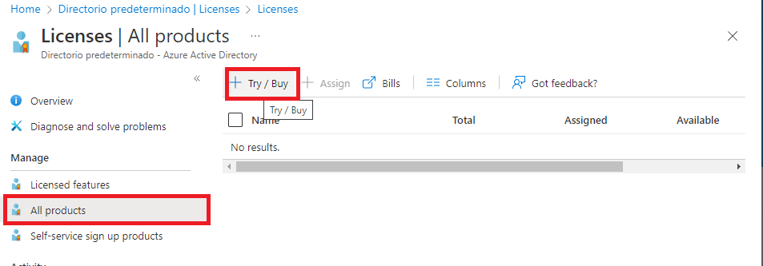

# LAB 1

## Ejercicio a realizar

Task 1: Create and configure Azure AD users

Task 2: Create Azure AD groups with assigned and dynamic membership

Task 3: Create an Azure Active Directory (AD) tenant (Optional - lab environment issue)

Task 4: Manage Azure AD guest users (Optional - lab environment issue)

## Task 1

Entramos en portal de Azure y seleccionamos Azure Active Directory.

Dentro de Manage en User, creamos nuevos usuario

Dentro de las opciones del usuario asignamos rol:

Y comprobamos los mismos desde una pestaña in-private. Y usamos dicho rol para crear un segundo usuario.

## Task 2

## Task 3 and 4

