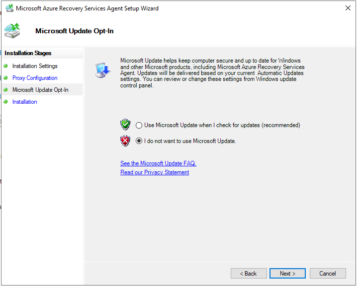
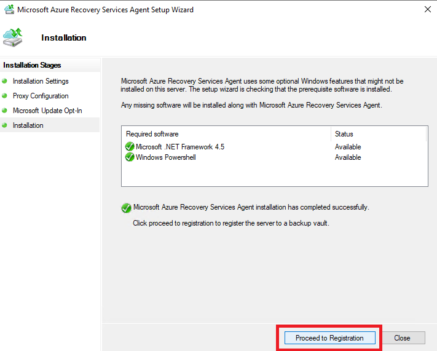
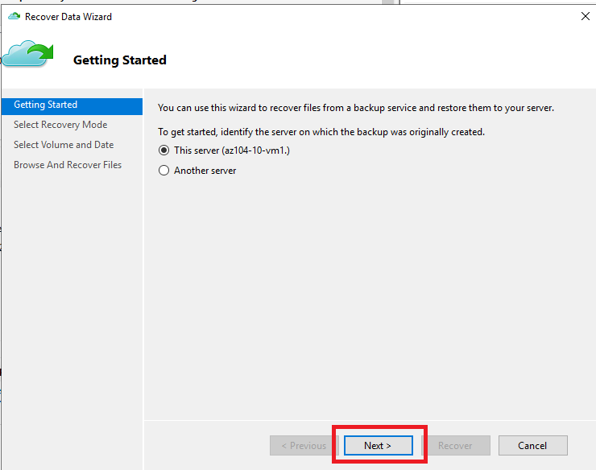
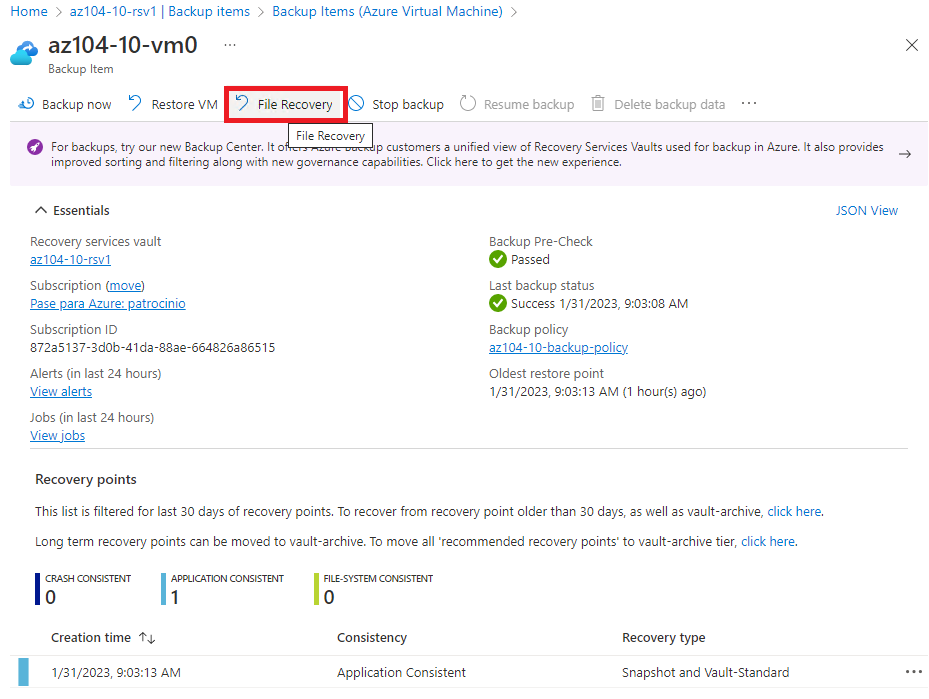
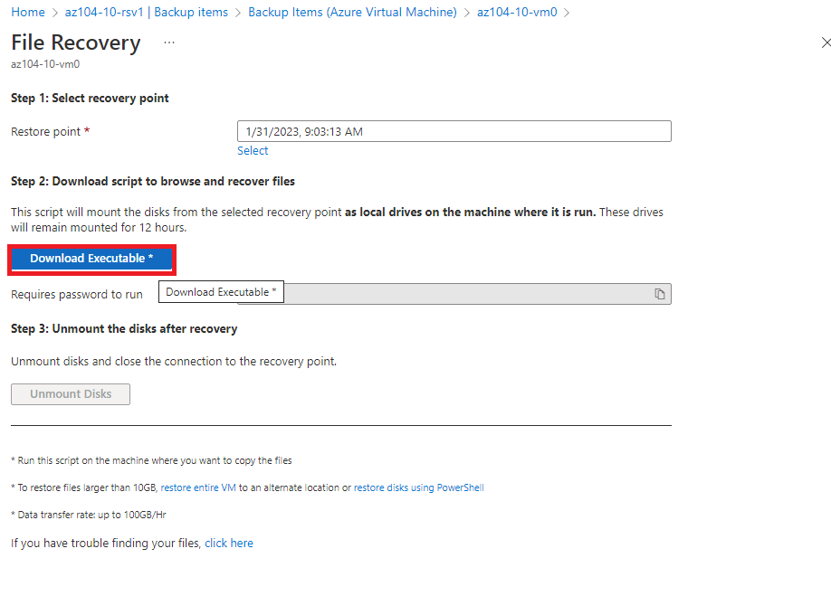
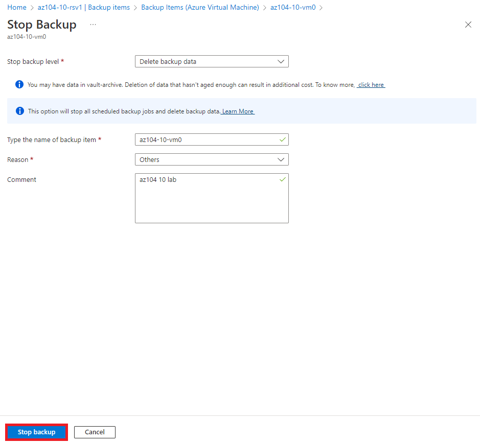
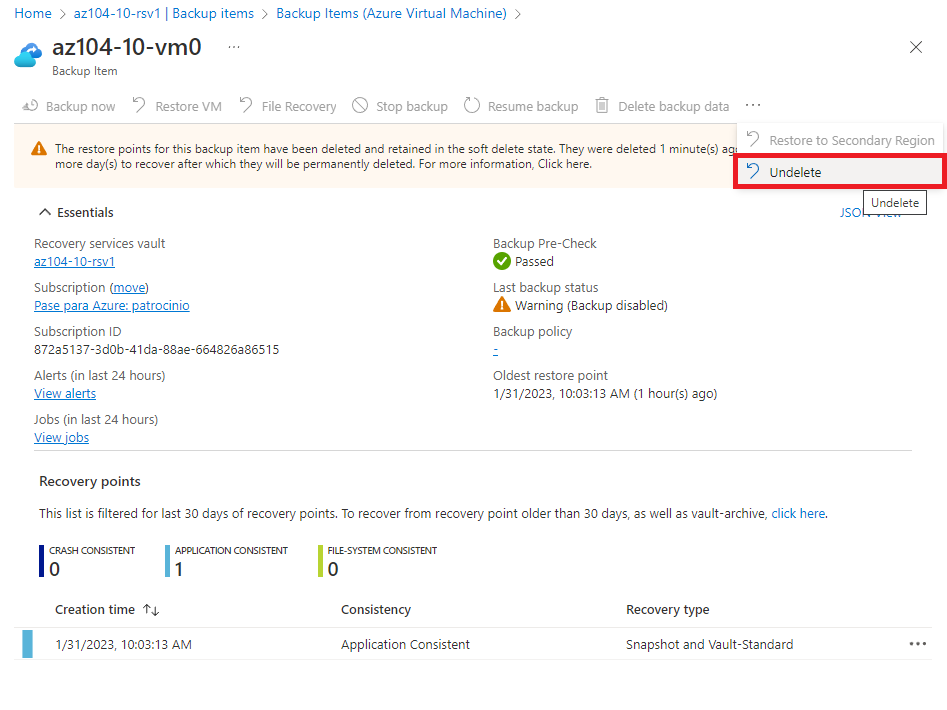
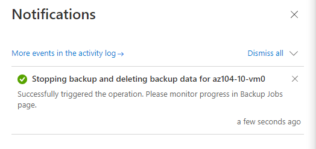

# LAB 10

## Ejercicio a realizar

Task 1: Provision the lab environment

Task 2: Create a Recovery Services vault

Task 3: Implement Azure virtual machine-level backup

Task 4: Implement File and Folder backup

Task 5: Perform file recovery by using Azure Recovery Services agent

Task 6: Perform file recovery by using Azure virtual machine snapshots (optional)

Task 7: Review the Azure Recovery Services soft delete functionality (optional)

## Task 1

Provisionamos el entorno de laboratorio usando plantillas:

## Task 2

## Task 3

## Task 4

## Task 5

## Task 6

## Task 6

