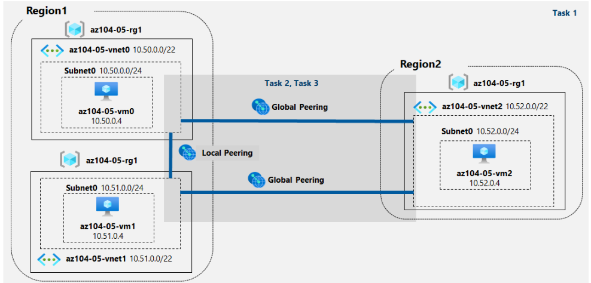
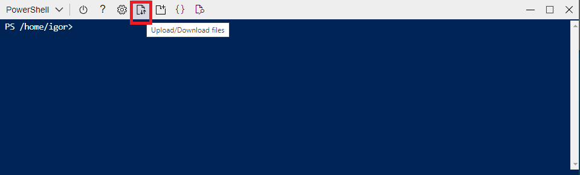
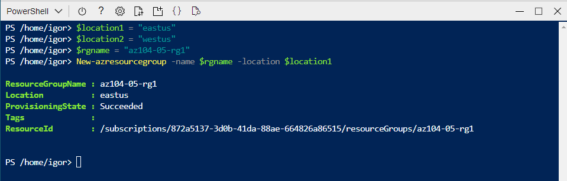
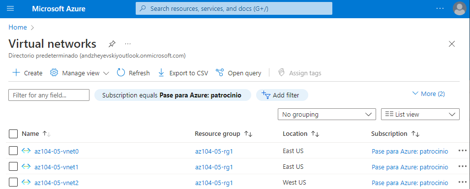
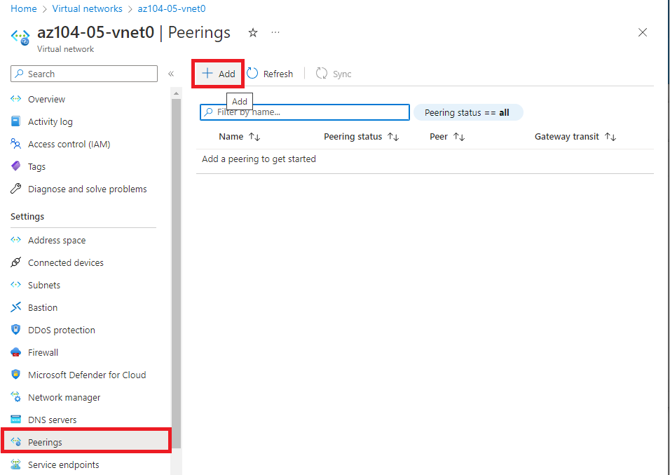
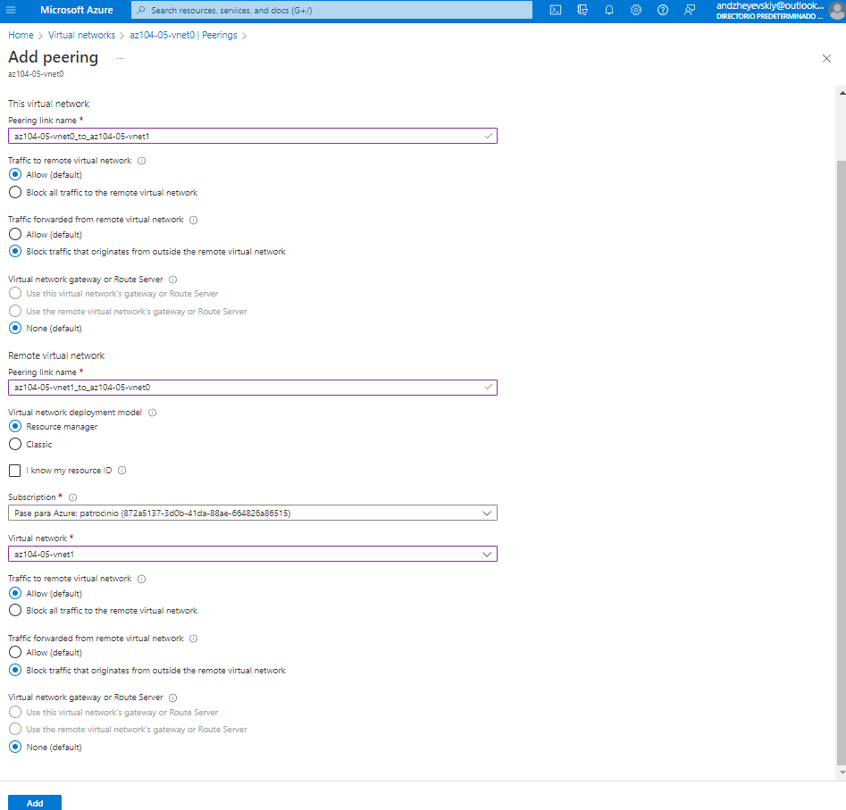
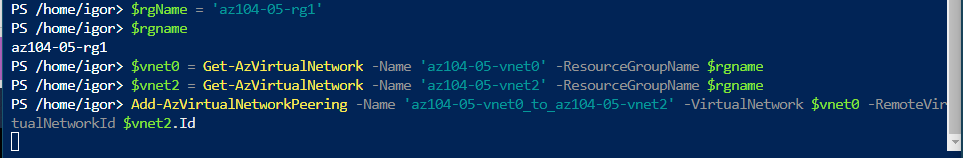
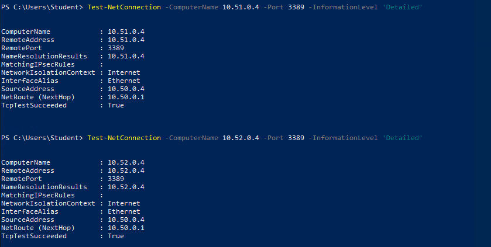

# LAB 5

## Ejercicio a realizar

Task 1: Provision the lab environment.

Task 2: Configure local and global virtual network peering.

Task 3: Test intersite connectivity.

## Task 1

## Task 2

## Task 3

