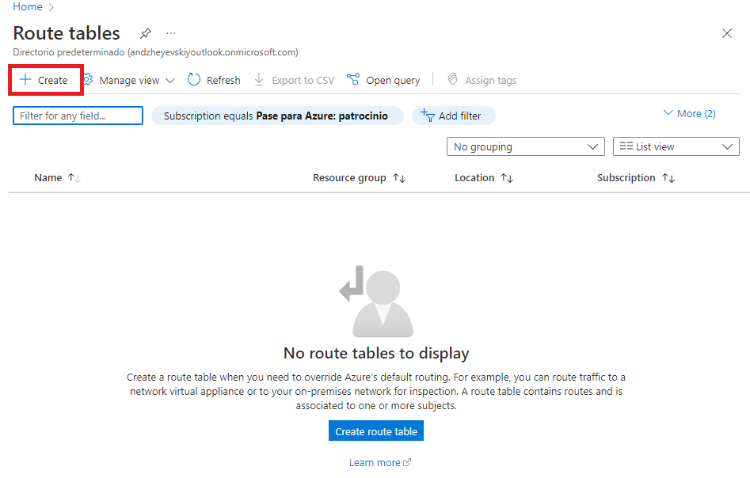
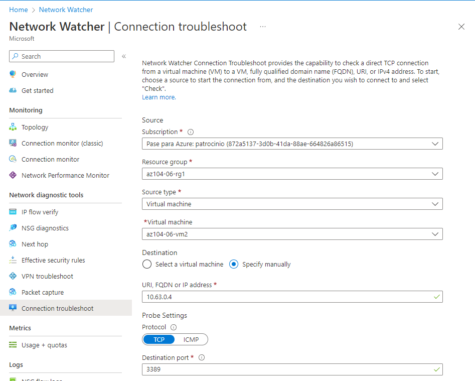

# LAB 6

## Ejercicio a realizar

Task 1: Provision the lab environment.

Task 2: Configure the hub and spoke network topology.

Task 3: Test transitivity of virtual network peering.

Task 4: Configure routing in the hub and spoke topology.

Task 5: Implement Azure Load Balancer.

Task 6: Implement Azure Application Gateway.

## Task 1

## Task 2

## Task 3

## Task 4

## Task 5

## Task 6

