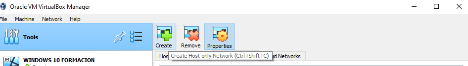
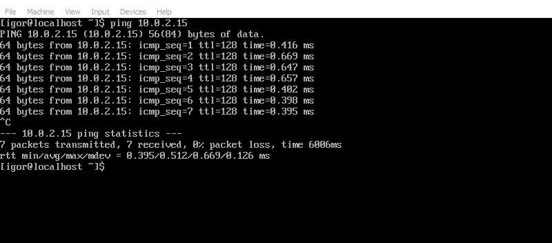

# Unir maquinas virtuales en la misma red (VirtualBox)

## Crear y conectar red NAT
Primeramente tenemos que crear una red NAT en VirtualBox, para ello entramos en "Tools" y Seleccionamos Network.

Seguidamente desde la pestaña "NAT Networks" seleccionamos Crear para que se cree nuestra red.

Y le asignamos nombre y valor de IP

Una vez creada la red, tenemos que conectarla a la maquina virtual deseada. Entramos en configuración y redes. Seleccionamos "NAT Network" en el tipo de red, y la red creada.

Repetimos el mismo proceso para cada maquina virtual.

## Comprobar la conexión en cada cada maquina.

### Windows 10 Y Windows Server 2019

Para conocer nuestra dirección IP, tenemos que usar el comando.

    ipconfig

Una vez tengamos las IP de varias maquinas, podemos comprobar la conexión entre ellas mediante el comando

    ping [IP ADRESS]
Si existe respuesta, es que hay conexión.

Así como  podemos comprobar la conexión a internet con el mismo comando.

    ping [WEB SITE]

### CentOS

Para conocer nuestra IP usaremos el comando:

    hostname -I
Dicho comando nos informará de nuestra IP.

> En caso de que el comando indicado no indique ninguna IP, significa
> que el sistema no esta conectado a la red que hemos creado
> anteriormente. En dicho caso consultar: [Conectar CentOS a una
> red](centosNW.md)

Una vez tengamos las IP de varias maquinas, podemos comprobar la conexión entre ellas mediante el comando

    ping [IP ADRESS]
Si existe respuesta, es que hay conexión.

Así como  podemos comprobar la conexión a internet con el mismo comando.

    ping [WEB SITE]

### Diagrama

