# Network tools

## 1. Set static ip on your linux device to connect to your LAN using nmcli command.

Para ello vamos a configurar la IP, puerta de enlace y DNS. Importante tener permisos de superusuario.

Para modificar IP:

`nmcli connection modify [Nombre de dispositivo] ipv4.address [IP/CIDR]`

Para modificar puerta de enlace:

`nmcli connection modify [Nombre de dispositivo] ipv4.gateway [Puerta de enlace]`

Para modificar DNS

`nmcli connection modify [Nombre de dispositivo] ipv4.dns [DNS]`

Y para verificar los cambios:

`nmcli`

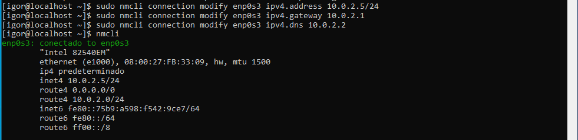

## 2. Disable the nmcli network interface

Para desactivar un dispositivo de red:
`nmcli connection down [Nombre de dispositivo]`

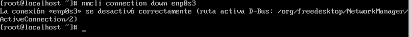

## 3. Activate the nmcli network interface

Para activar un dispositivo de red:
`nmcli connection up [Nombre de dispositivo]`

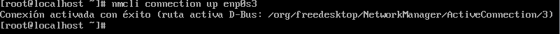

## 4. Check with the ip command your configuration

Para comprobar la IP:
`ip addr`

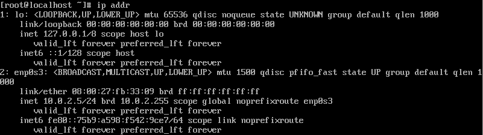

## 5. Do ping to nodes on your network

Commando: 
`ping [IP address]`

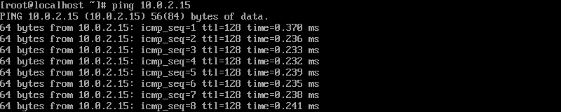

## 6. Lists all .txt files in the current directory and then counts those .txt files and saves the output to a new file

Se usaría el comando ls en conjunto con wc.

`. ls *.txt | wc -l > [nombre de archivo saliente].txt`

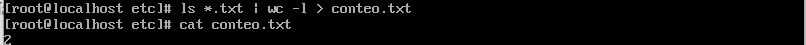

## 7. Create a file from scratch on linux and include the following information

> This is the file create in linux with some information will be copied to another host in the network

Para crear archivo:
`echo [contenido del archivo] > [nombre del archivo] `

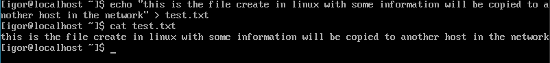

## 8. Copy it from another host on your network

`scp [nombre de archivo] [Usuario]@[IP]:[Directorio]`

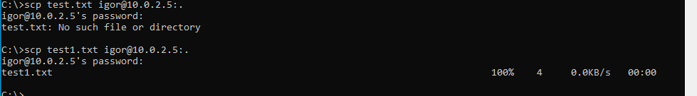

## 9. Connect to the other host and verify that it has been created.

Para connectar remotamente:

`ssh [Usuario]@[IP]`

Y para ver archivos de un directorio:

`ls`

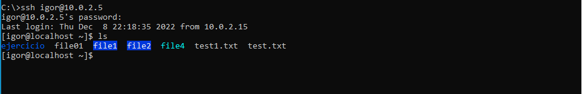

## 10. Download from ubuntu website page the iso with wget command and curl command.

Primero tenemos que instalar la funcion wget para ello usaremos el siguiente comando desde un usuario sudo:

`yum install wget`

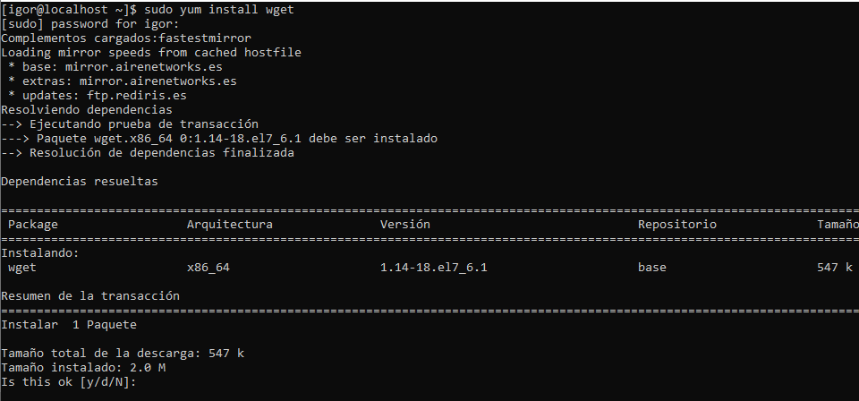

Para usar el comando simplemente de utiliza:

`wget [URL del archivo a descargar]`

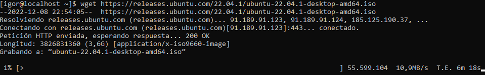

## 11. Download SHA256 files and confirm that the downloaded file is correct (SHA256SUM) from the same page.

Descargamos el archivo:

`wget [Direccion del archivo]`

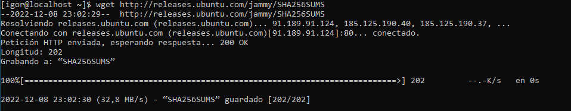

y comprobamos el contenido

`sha256sum -c SHA256SUMS`

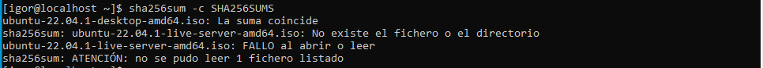

