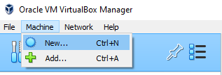
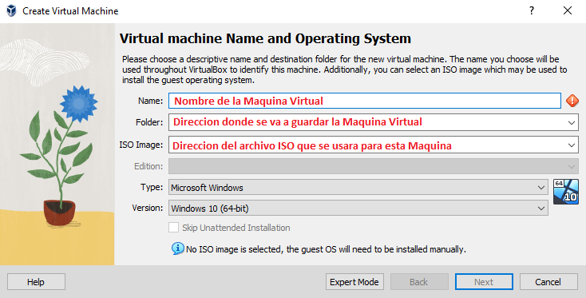
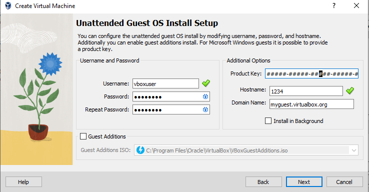
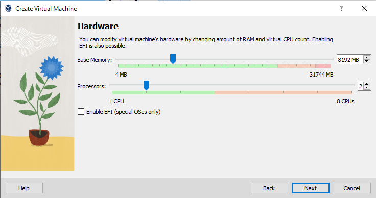
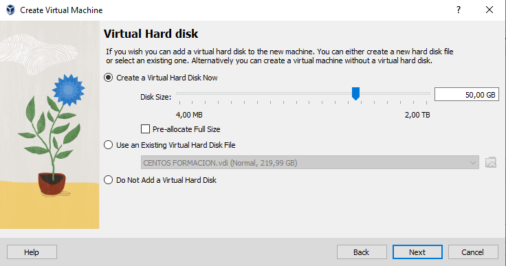
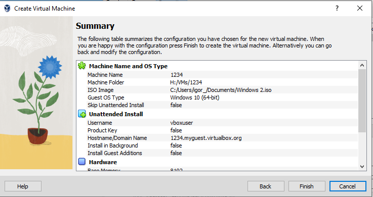
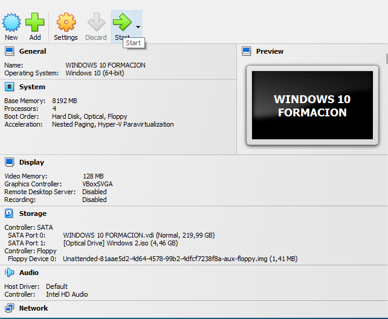

# Creando una Maquina Virtual en Oracle VirtualBox

Una vez tengamos instalado "Oracle VM VirtualBox" podemos comenzar con la creación de nuestra maquina virtual.

Para ello accedemos a la opción "New" dentro de la pestaña desplegable "Machine".

El sistema nos pedirá varios datos previos antes de crear la maquina virtual.

Una vez completamos los datos solicitados. Clicamos en "Next" para continuar.

A continuación nos aparecerá la opción de configurar la maquina para el uso desde otro ordenador(ordenador invitado). A menos que queramos usar la misma maquina en varios ordenadores, no cambiaremos los ajustes por defecto. 

Seguidamente se nos pedira asignar recursos a la Maquina Virtual, primeramente Memoria(RAM) y Procesadores.

*Estos recursos se pueden modificar posterior a la creación de la MV*

Y posteriormente de Almacenamiento. 

**Es recomendable asignar recursos en el rango recomendado por la aplicación(barra verde).** 

Tendremos una pantalla resumen con las selecciones que hemos realizado. Clicamos en "Finalizar" para crear la MV.

Finalmente podemos correr la maquina que acabamos de crear clicando en "Start" cuando seleccionamos la Maquina Virtual deseada.

