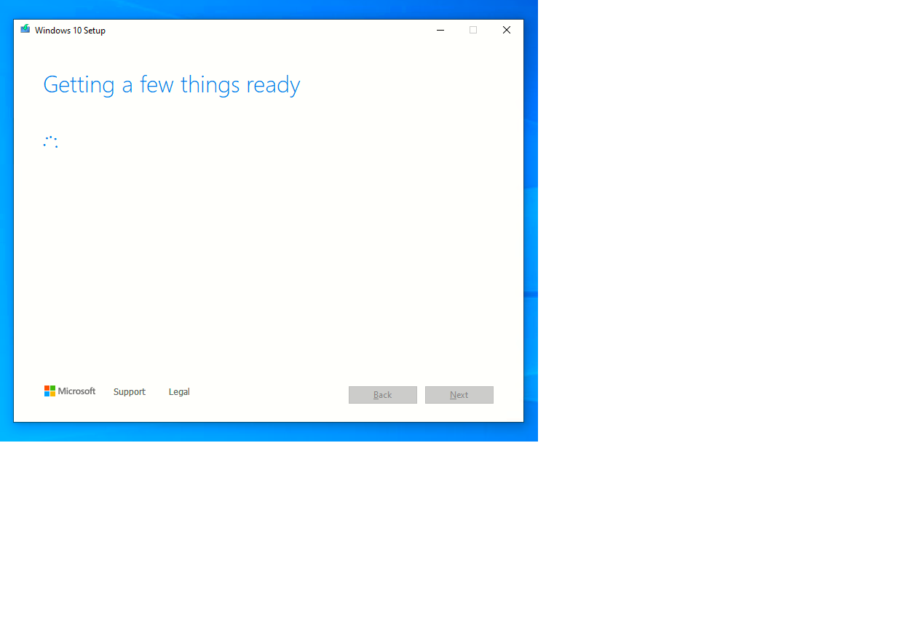

# Instalando Windows 10

25 Noviembre 2022

## Paso 1
Descargamos el fichero ISO de la heramienta "Windows creation tool" desde el siguiente enlace: [Pichar aqui](https://www.microsoft.com/es-es/software-download/windows10)

Al iniciar el programa "Windows creation tools, aparece el siguiente asistente 

