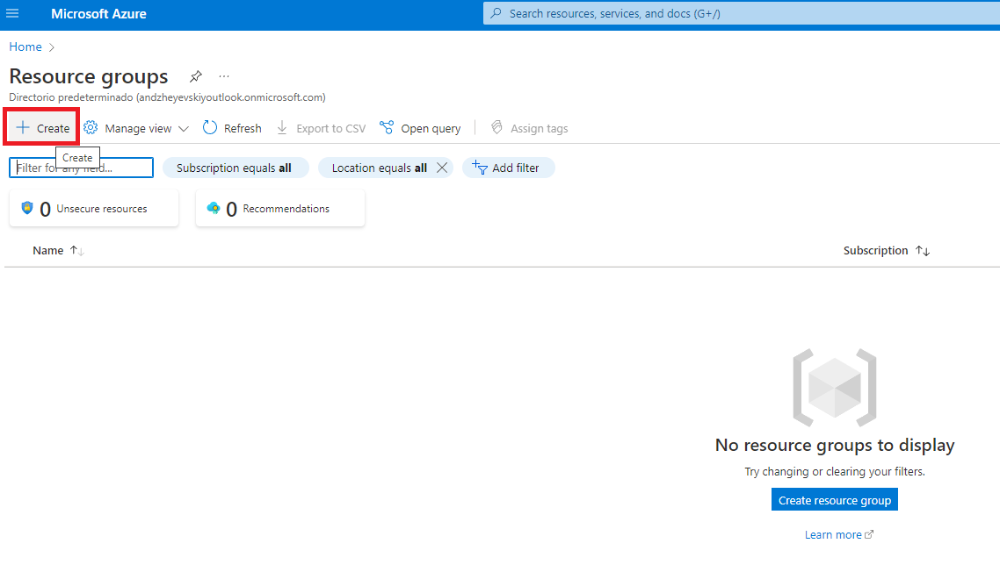
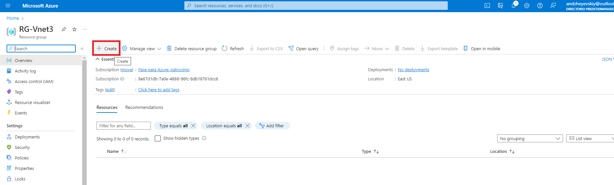
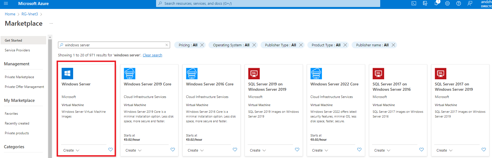
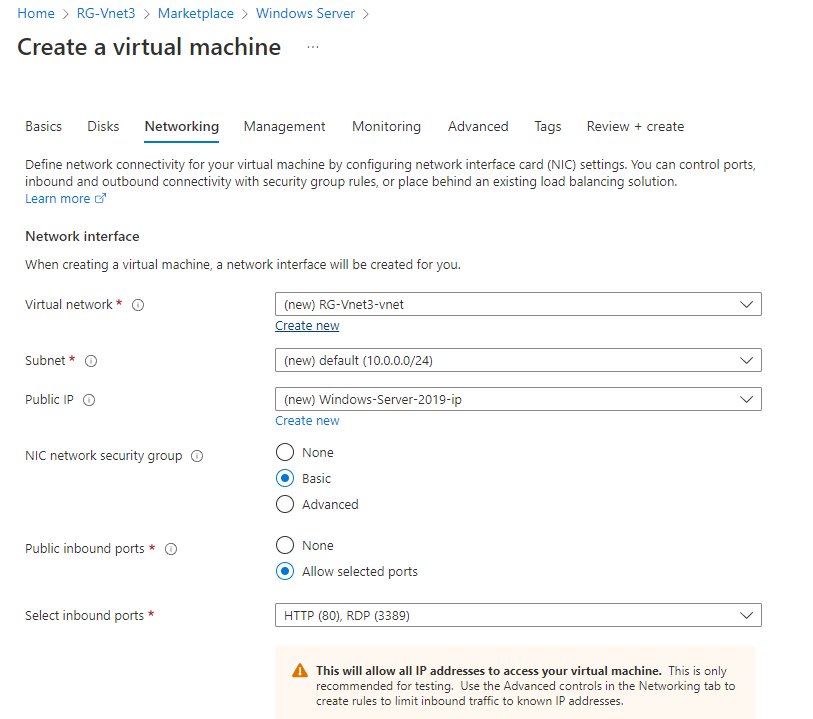

# Redes Virtuales en Azure.

## Ejercicio a realizar

Este ejercicio se basara en el siguiente diagrama

## Documentacion

Creamos un Grupo de recursos para el ejercicio:

Y posteriormente creamos una maquina virtual Windows Server en el grupo recien creado:

Habilitamos los puertos 80(http) y 3389(Remote Desktop):

Creamos una red correspodinete a la maquina virtual:

Una vez creada, repetimos el mismo proceso, esta vez sin crear una nueva red, sino conectamos a la que anteriormente hemos creado:

Una vez terminado, tendremos creadas dos maquinas conectadas a la misma red.

