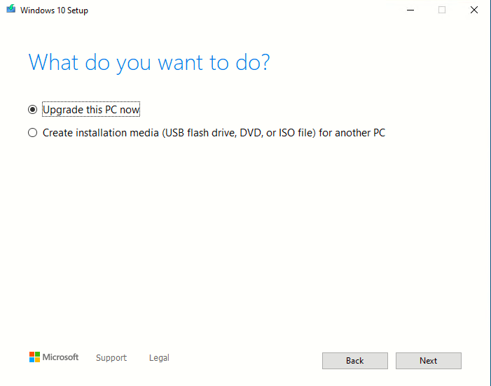
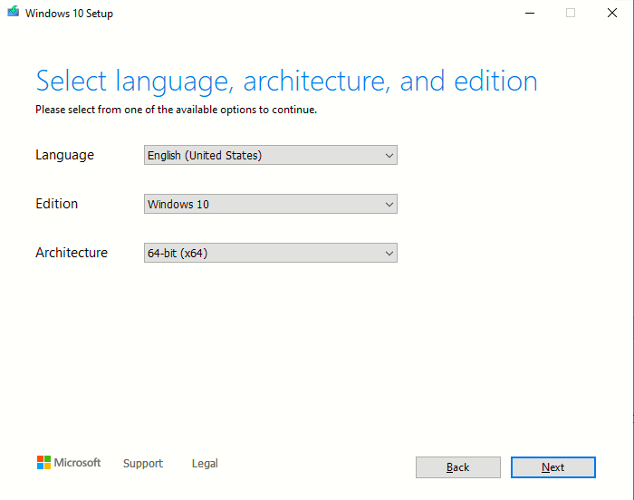
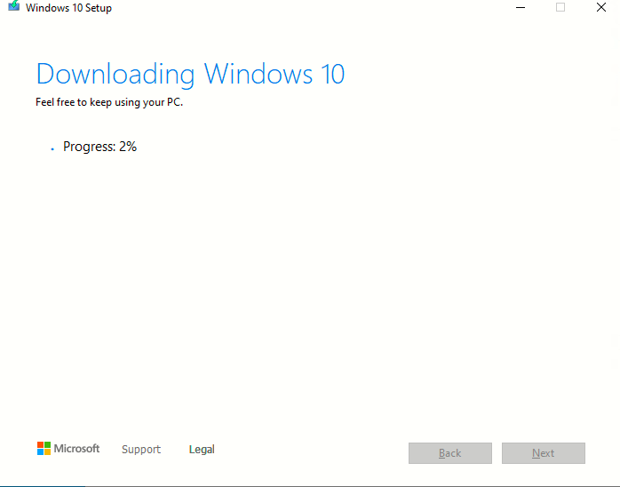

# Instalando Windows 10

25 Noviembre 2022

## Paso 1
Descargamos el fichero ISO de la heramienta "Windows creation tool" desde el siguiente enlace: [Pichar aqui](https://www.microsoft.com/es-es/software-download/windows10)

Al iniciar el programa "Windows creation tools, aparece el siguiente asistente 

Aceptamos los terminos y licencia

Seleccionamos "Create installation media (USB, Flash Drive, DVD or ISO file) for another PC

Seleccionamos Idioma y version.

Seleccionamos ISO File y elegimos la direccion donde deseamos que se guarde.

Una vez selecionado, comenzara el proceso de creacion del archivo ISO.

Una vez terminado, se nos confirmara la direccion en la que se ha descargado el archivo ISO. 

Ahora ya disponemos de el archivo ISO para bien usarlo para un ordenador personal o para una maquina virtual.
